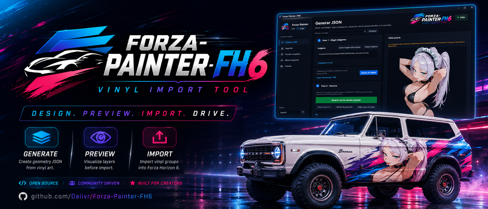
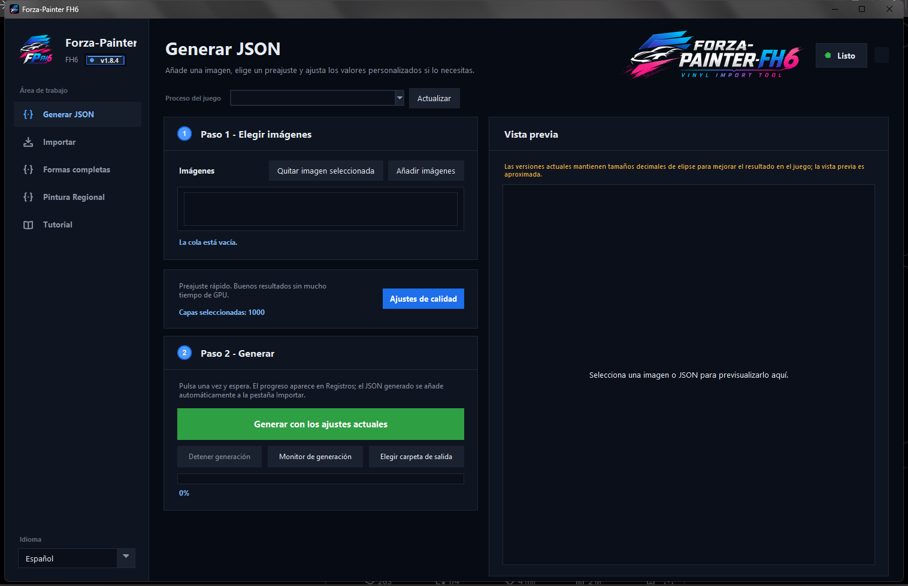
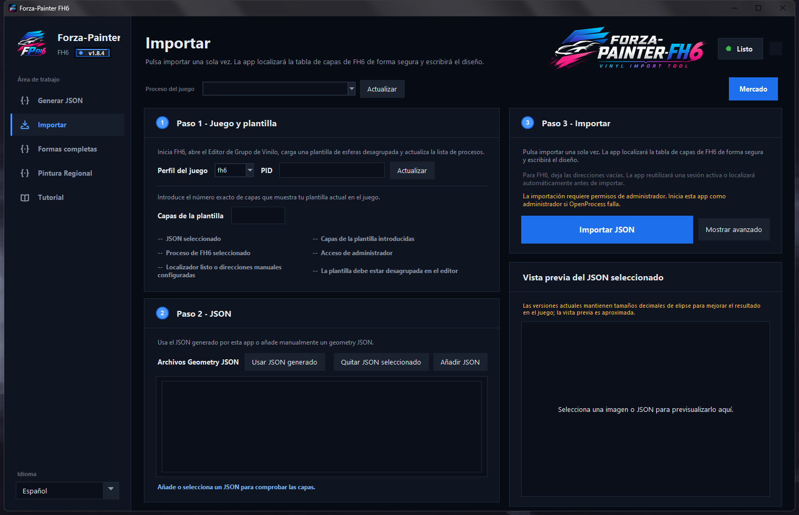
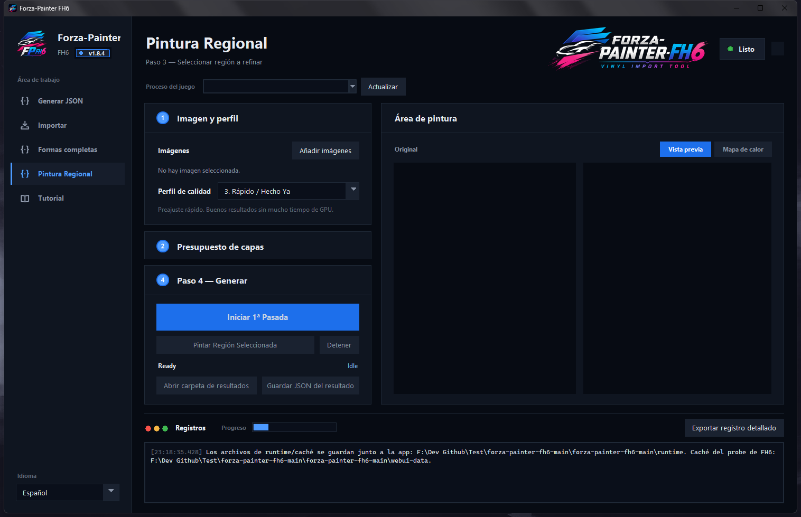
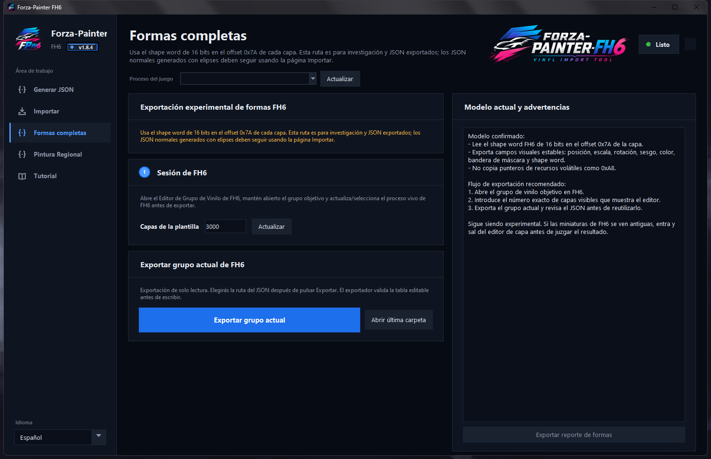
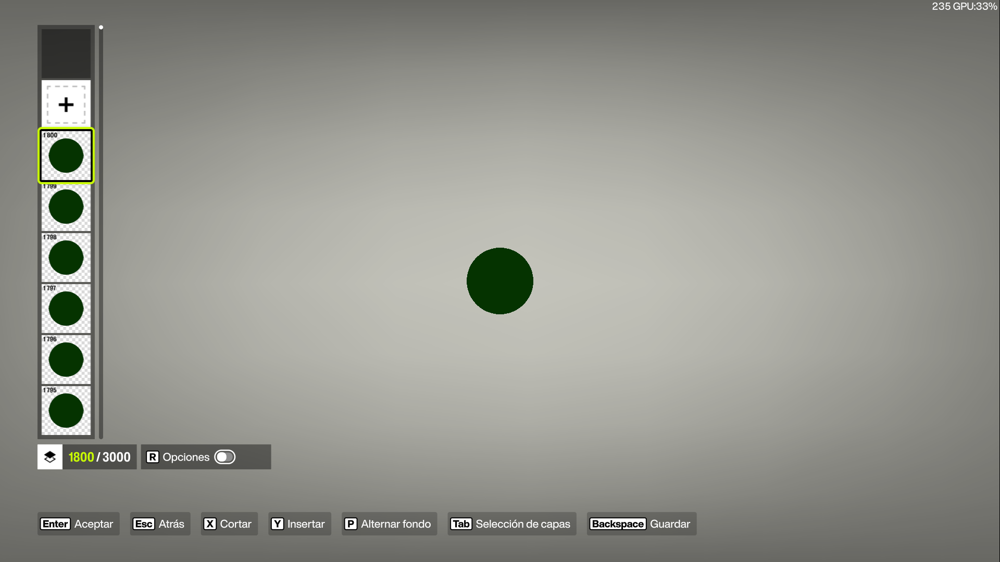
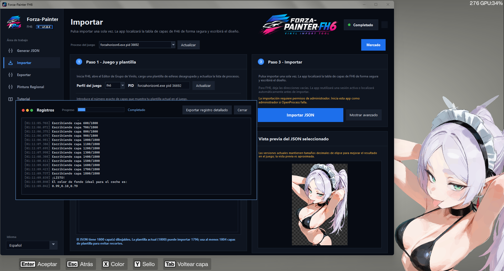
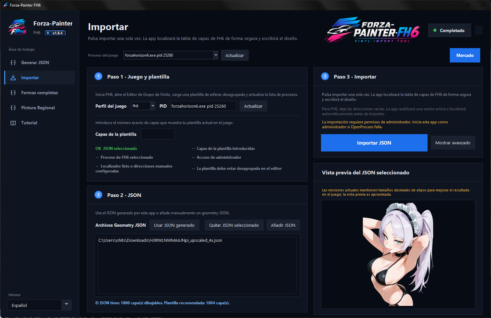
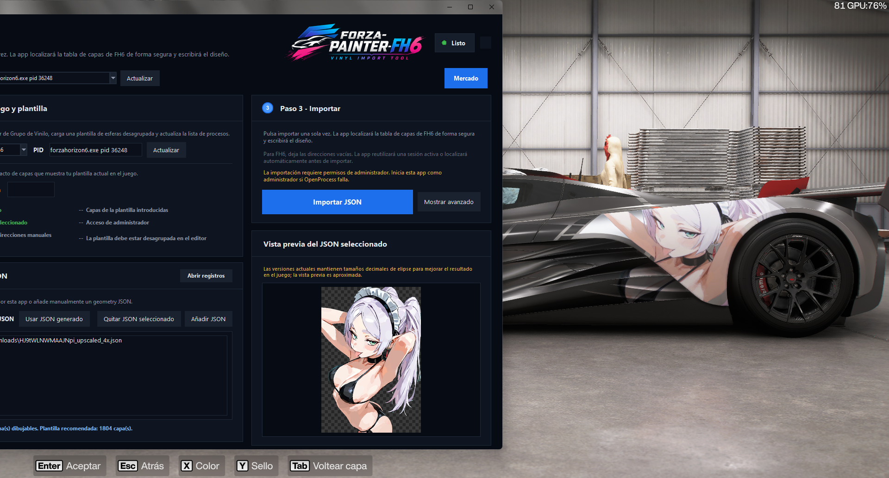

<p align="center">
  
</p>

# Forza-Painter FH6

**Vinyl Import Tool for Forza Horizon 6.** Convert images into Forza-compatible vinyl geometry, preview the result, and import it into the FH6 Vinyl Group Editor from one desktop app.

<p>
  <a href="README.md">English</a> |
  <a href="README.es-ES.md">Español</a> |
  <a href="README.es-MX.md">Español MX</a> |
  <a href="README.zh-CN.md">中文</a> |
  <a href="README.ko-KR.md">한국어</a>
</p>

<p>
  <code>v1.8.4</code> <code>Windows</code> <code>Forza Horizon 6</code> <code>GPU/OpenCL</code> <code>One-file EXE</code>
</p>

## What It Does

Forza-Painter FH6 is built around the current FH6 vinyl workflow:

- Generate geometry JSON from PNG, JPG, or BMP images.
- Preview generated JSON before importing it.
- Import geometry JSON into an ungrouped FH6 vinyl template.
- Browse and download community presets from the in-app Market.
- Refine important areas with Region Paint.
- Export and import experimental full-shape/type-code JSONs for research workflows.
- Keep logs, runtime data, previews, and import diagnostics inside local app folders.

Normal users should download the EXE from [Releases](https://github.com/Daiivr/Forza-Painter-FH6/releases). You do not need Python, a virtual environment, or the source ZIP unless you are developing the project.

## Current App

These screenshots were captured from the current `v1.8.4` desktop UI.

<table>
  <tr>
    <td width="50%">
      
      <strong>Generate JSON</strong><br>
      Add source images, choose a quality preset, tune generation settings, and watch progress.
    </td>
    <td width="50%">
      
      <strong>Import</strong><br>
      Select the FH6 process, enter the exact template layer count, preview JSON, and import.
    </td>
  </tr>
  <tr>
    <td width="50%">
      
      <strong>Region Paint</strong><br>
      Generate a base pass, select key regions, and spend extra layers where detail matters most.
    </td>
    <td width="50%">
      
      <strong>Export</strong><br>
      Experimental FH6 shape-word export/import tooling for full-shape JSON research.
    </td>
  </tr>
</table>

## In-Game Workflow

<table>
  <tr>
    <td width="50%">
      
      <strong>Prepare a template</strong><br>
      Open the FH6 Vinyl Group Editor, load a sphere-layer template, and ungroup it.
    </td>
    <td width="50%">
      
      <strong>Import the JSON</strong><br>
      Keep the editor open while the app locates the editable layer table and writes the design.
    </td>
  </tr>
  <tr>
    <td width="50%">
      
      <strong>Check the preview</strong><br>
      JSON previews are useful for layer checks, but the in-game result is the final reference.
    </td>
    <td width="50%">
      
      <strong>Apply it to the car</strong><br>
      Once imported and saved, use the vinyl group like any other FH6 design.
    </td>
  </tr>
</table>

## Quick Start

1. Download `forza-painter-fh6-v1.8.4.exe` from [Releases](https://github.com/Daiivr/Forza-Painter-FH6/releases).
2. Place the EXE in a normal writable folder, for example `Desktop\forza-painter-fh6`.
3. Run the EXE. If import fails because of Windows process permissions, run it as administrator.
4. In FH6, open `Create Vinyl Group` / `Vinyl Group Editor`.
5. Load a sphere template, ungroup it, and note the exact in-game layer count.
6. In Forza-Painter FH6, generate or add a JSON, select the FH6 process, enter the template layer count, and import.

## Generate JSON

The Generate JSON page converts images into Forza-friendly geometry files using the bundled GPU/OpenCL generator.

1. Add one or more images.
2. Choose a quality preset.
3. Optionally open `Quality settings` for layer count, resolution, random samples, and other advanced values.
4. Start generation and wait for the preview/logs to update.
5. Use the highest-layer JSON that fits your template.

Generated files are saved beside the source image. A single image can produce checkpoint files such as `image.500.json`, `image.1000.json`, `image.3000.json`, and a final `image.json`.

## Import JSON

The Import page writes generated geometry into the current FH6 Vinyl Group Editor session.

- The FH6 template must be ungrouped before import.
- The layer count entered in the app must match the game exactly.
- Keep FH6 in the Vinyl Group Editor while importing.
- Do not switch menus while the app is scanning or writing.
- If Windows blocks process access, restart the app as administrator.

FH6 needs a few extra boundary layers for saving and applying bounds correctly. For example, a 1000-layer JSON should use a template with at least 1004 layers; a 3000-layer template usually leaves about 2996 drawable layers.

## Region Paint

Region Paint is for images where some areas need more detail than others. It generates a first pass, lets you select a rectangle or ellipse, then spends additional layers only in that selected area.

Current Region Paint tools include:

- First-pass and region-pass layer budgets.
- Rectangular and elliptical selections.
- Drag, resize, rotate, and scroll-wheel controls.
- Preview and heatmap tabs.
- Pass history, remaining-layer tracking, and result JSON export.

## Market

The Import page includes an in-app Market button for painter6.com presets. You can browse designs, preview selected presets, download geometry JSON, and add the downloaded JSON directly to the import list.

## Export

Export is experimental. It is meant for exported or handmade FH6 type-code JSONs, not the normal ellipse geometry produced by the generator.

- Uses the 16-bit FH6 shape word at layer offset `0x7A`.
- Exports stable visual fields such as position, scale, rotation, skew, color, mask/banner data, and shape word.
- Avoids volatile resource pointers such as `0xA8`.
- Uses bundled FH6 vinyl resources for previews when available.

Use the standard Import page for normal generated geometry JSONs.

## Runtime Folders

The one-file EXE extracts its internal files temporarily and writes normal app data beside the EXE:

- `runtime/`: logs, generation previews, Region Paint sessions, market downloads, and temporary files.
- `webui-data/`: local preferences and FH6 probe/session cache.

You can delete these folders while the app is closed if you want to reset local runtime data.

## Troubleshooting

- **Import does not start:** run the app as administrator and confirm the FH6 editor is open.
- **Template cannot be located:** ungroup the template, enter the exact layer count, and stay in the editor during scanning.
- **Result looks blurry:** raise the output layers and `Random samples`; values above `200000` usually improve final clarity.
- **Preview differs from FH6:** current JSON previews are approximate because FH6 keeps decimal ellipse sizes that the app preview simplifies.
- **GPU/OpenCL error:** update NVIDIA, AMD, or Intel graphics drivers.
- **Need help debugging:** use `Export detailed log` and attach the log when opening an issue.

## Development

Source runs are mainly for development and testing:

```powershell
install_dependencies.bat
start_app.bat
```

Useful project files:

- `src/app.py`: desktop UI and workflows.
- `src/generator_backend.py`: generator command/build integration.
- `src/import_readiness.py`: pre-import checks.
- `src/region_painter/`: Region Paint workflow modules.
- `scripts/make_exe_release.ps1`: release packaging.
- `CHANGELOG.md`: full version history.

## Resources

- Releases: [github.com/Daiivr/Forza-Painter-FH6/releases](https://github.com/Daiivr/Forza-Painter-FH6/releases)
- Import walkthrough video: [bilibili.com/video/BV1hG5Z6nENZ](https://www.bilibili.com/video/BV1hG5Z6nENZ)
- Bundled GPU generator reference: [zjl88858/forza-painter-geometrize-gpu](https://github.com/zjl88858/forza-painter-geometrize-gpu)
- Full changelog: [CHANGELOG.md](CHANGELOG.md)

## License

See [LICENSE](LICENSE), [LICENSE.custom-importer](LICENSE.custom-importer), and [LICENSE.kloudys-custom-importer](LICENSE.kloudys-custom-importer).
